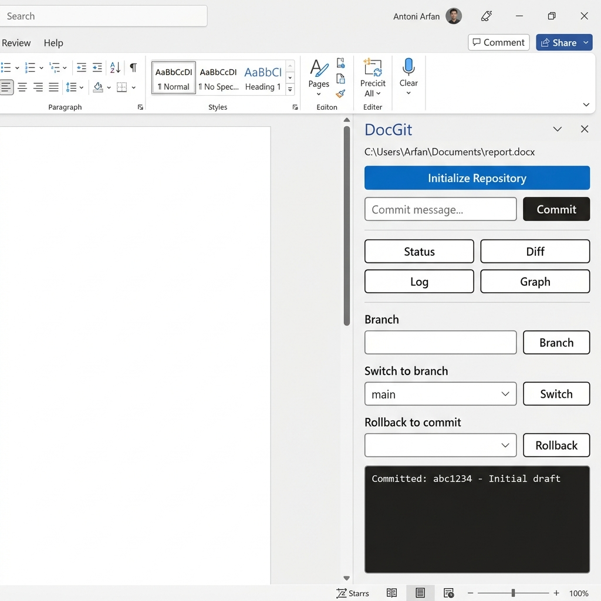
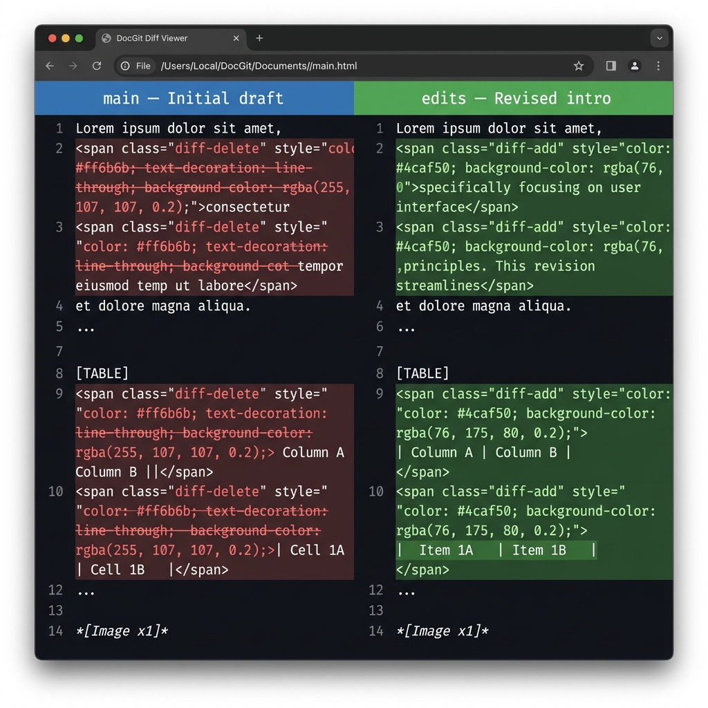
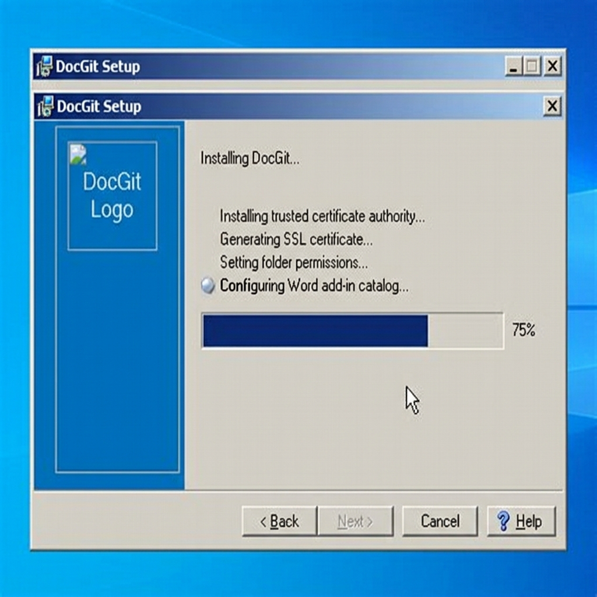

# DocGit

> Git-like version control for Microsoft Word documents — built as an Office Web Add-in.



---

## What is DocGit?

DocGit brings version control to Word documents without SharePoint, OneDrive, or any cloud service. It works entirely on your local machine, storing document snapshots in a `.docgit/` folder alongside your files.

You get the core Git workflow — commit, branch, switch, diff, rollback, merge — accessed directly from a sidebar inside Microsoft Word.

---

## Features

| Feature | Description |
|---|---|
| **Commit** | Snapshot any `.docx` file with a message |
| **Branch** | Create and switch between named branches |
| **Diff viewer** | Side-by-side comparison of paragraphs, tables, and images |
| **Rollback** | Restore any previous committed state |
| **Merge** | Combine changes from another branch |
| **Log / Graph** | View commit history and branch graph |
| **Branch guard** | Blocks branch switching if you have uncommitted changes |

---

## Screenshots

### Word Sidebar
The DocGit panel lives inside Word. No separate window needed.


### Diff Viewer
Compare any two commits, branches, or working copy vs last commit. Tables and images are included.



### Installer
One-click setup — handles SSL certificates, Word add-in registration, and auto-start automatically.



---

## Installation

### Option A — Installer (recommended)

1. Download **DocGit_Setup.exe** from the [Releases](../../releases) page
2. Run as **Administrator**
3. Open Microsoft Word
4. Go to **Insert → Add-ins → My Add-ins → Shared Folder**
5. Select **DocGit** → click **Add**

The installer automatically:
- Generates a trusted local SSL certificate via `mkcert`
- Registers the add-in catalog in Word's trusted sources
- Adds the server to Windows startup

### Option B — Run from source

```bash
# Clone the repo
git clone https://github.com/CatOn60Hz/docgitt.git
cd docgitt

# Install dependencies
pip install -r requirements.txt

# Generate SSL cert (requires mkcert)
mkcert localhost 127.0.0.1

# Start the server
python docgit_server.py
```

Then load the add-in in Word via **Insert → Add-ins → Shared Folder**.

---

## Usage

### First time setup
1. Open a Word document
2. Click **Initialize Repository** in the sidebar
3. Type a commit message and click **Commit**

### Day-to-day workflow
```
Edit document → Commit → Branch → Diff → Rollback
```

### CLI (optional)
The engine also works as a standalone CLI:

```bash
docgit init
docgit commit MyDocument.docx -m "First draft"
docgit status
docgit log
docgit diff MyDocument.docx
docgit branch feature-edits
docgit switch feature-edits
docgit rollback <commit-id>
docgit merge feature-edits
```

---

## Architecture

```
docgit_server.py     Flask HTTPS server — bridges Word sidebar to docgit engine
docgit.py            Core version control engine (CLI + library)
static/
  taskpane.html      Word task pane UI
  taskpane.css       Styles
  taskpane.js        API calls + UI logic
manifest.xml         Office Add-in manifest
docgit.iss           Inno Setup installer script
build_installer.py   Build script (PyInstaller + Inno Setup)
```

Commits are stored as SHA-256 hashed `.docx` snapshots in `.docgit/objects/`. The index file (`.docgit/index.json`) tracks branches, HEAD, and the commit graph.

---

## Building from source

Requires: Python 3.10+, PyInstaller, Inno Setup 6, mkcert

```bash
pip install pyinstaller flask flask-cors python-docx rich click pywin32
python build_installer.py
# Output: Output/DocGit_Setup.exe
```

---

## Requirements

- Windows 10 / 11 (64-bit)
- Microsoft Word 2019 or Microsoft 365

---

## License

MIT
